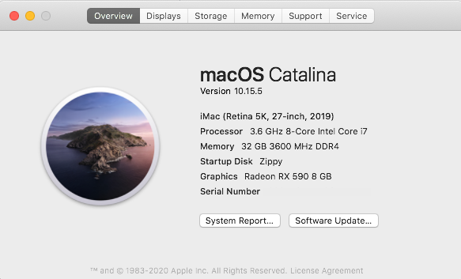
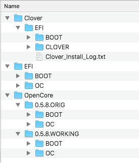

# Hackintosh Catalina (10.5.5) Guide for Gigabyte Z390 Aorus Master (OpenCore) with FileVault

This build is "Vanilla". I used [this guide](https://dortania.github.io/OpenCore-Desktop-Guide/) as a starting point, with references and checking to [cmer's awesome guide](https://github.com/cmer/gigabyte-z390-aorus-master-hackintosh/blob/master/README.md).

The biggest difference is that I have FileVault and the GUI OS picker enabled, and I've updated the kexts, SSDTs, etc to the latest for 0.5.8 and 10.15.5

Yes - this is totally ripped from [cmer](https://github.com/cmer) - all credit to him.

### Hardware

See my [Hardware List](https://pcpartpicker.com/list/4LYjk6) on PCPartsPicker.

### What's Working/What's Not

##### Working
- Ethernet
- Onboard Audio (including digital audio)
- APFS
- Sleep/Wake
- All USB ports at 3.x speed
- iMessage
- App Store
- Facetime
  - I use a Logitech C920 webcam
- APFS
- Handoff
- Bluetooth & Wi-Fi - via Broadcom adapter
  - I ordered this from eBay: Dual Band BCM94360CS2 PCI-E 867Mbps 802.11AC BT4.0 Wifi PCI-Express Adapter Card
  - Most important is to search for a supported card - the [Wireless Buyers Guide](https://dortania.github.io/Wireless-Buyers-Guide/unsupported.html) has the info you need
- Unlock with Apple Watch
- Airdrop
- AirPlay
- Continuity
- ALL DRMs:
  - iTunes Movies (FairPlay 1.x)
  - Netflix (FairPlay 2.x/3.x)
  - Some Amazon Prime content, but not all. (FairPlay 2.x/3.x)
  - Apple TV+ (FairPlay 4.x)
- Power Nap
- NVRAM
- FileVault

##### Not Working (as expected)
- Built-in WIFI - disabled in BIOS - I use Ethernet for primary networking, and the keep the Broadcom card for wifi purely so Airdrop, unlock with AppleWatch etc work.
- Onboard Bluetooth - I use the Broadcom card.

### Step By Step Instructions

I just followed the [OpenCore Desktop Guide](https://dortania.github.io/OpenCore-Desktop-Guide/). When in doubt, just look at my KEXTs, drivers and config.list for guidance.

### USB Port Map & SSDT

See [CMER's USB_MAP.md](https://github.com/cmer/gigabyte-z390-aorus-master-hackintosh/blob/master/USB_MAP.md) for a map of all the ports on the Aorus Z390 Master.

### My EFI

You are welcome to use my EFI folder. However, make sure you set the following:

- SystemSerialNumber
- SystemUUID
- MLB

### Steps

I was using Clover previously, but completely build this OpenCore build from scratch, with no attempt to migrate over.

On my EFI partition I have:

- OpenCore
  - 0.5.8.ORIG - this is my initial working build of OpenCore (debug, with extra logging, and no GUI)
  - 0.5.8.WORKING - this is a copy I make of my booted EFI whenever I make changes for easy roll-back
- Clover
  - EFI - this is my final working Clover EFI
- EFI - this is the EFI I boot from

I also keep the above copied onto the EFI partition of a USB drive, as a failback.

With the GUI enabled, copying the booted (ie known working) EFI to the .WORKING version doesn't have enough space due to the large resources folder, so I leave that empty on the backup. It doesn't change often.

